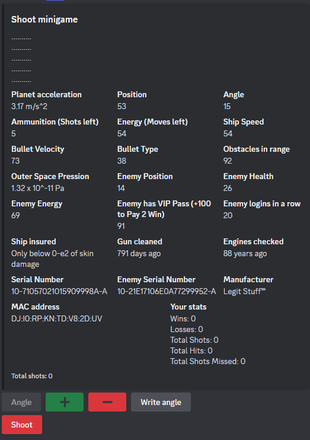
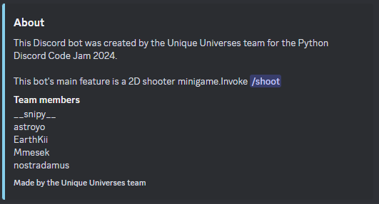

# Unique Universes CJ24's Application

Our application is a shooting minigame, based on precise and calculated shots from your ship to the enemy ship.

## How is the theme represented ?

The minigame relies on the user’s ability to calculate a shot with the help of (a lot of) raw information provided to the user.
 This is the interesting part, the user has to face an information overflow and extract the important data in order to play the game.

## Availables commands

- /shoot - Play the minigame.



The rules are simple. You are given an amount of ammunitions with which you can hit an enemy. The enemy position is proportional to your position, instead the health is capped at a given value and will decrease when you hit the enemy.
After every shot the enemy will change position, though if you have hitted the enemy you will have 1 ammunition given back and some HP regenerated.
If you miss the enemy nothing happens, you just lost one ammunition and the enemy change position.

- /about - Get information about the application and the team.



# Team members contribution

- **@Snipy7374 (Team Leader)**: Worked on the bot's structure, the game design, the game logic (physics/maths & database communication) and the documentation.
- **@Mmesek**: Worked on the game design, the docker image, the game logic (physics/maths), the UI and the documentation.
- **@stroh13**: Worked on the about command and the game logic (physics/maths).
- **@Astroyo**: Worked on the game logic (database communication).
- **@EarthKiii**: Worked on the game design and the documentation.

# Major Bugs notice

So far everything was too good to be true. Indeed our project have one CRITIC bug (at least known at this time). This bug involve the `/shoot` command. I will provide an hotfix below, pls judges forgive us for this :pray:

```diff
diff --git a/src/exts/minigames.py b/src/exts/minigames.py
index 23709c1..a183fcf 100644
--- a/src/exts/minigames.py
+++ b/src/exts/minigames.py
@@ -6,6 +6,7 @@ from typing import TYPE_CHECKING
 import disnake
 from disnake.ext import commands
 from src.views.shoot import ShootMenu
+from src.database import PlayerNotFoundError

 if TYPE_CHECKING:
     from src.bot import Universe
@@ -49,7 +50,10 @@ class Minigames(commands.Cog):
     @commands.slash_command()  # type: ignore[reportUnknownMemberType]
     async def shoot(self, inter: disnake.GuildCommandInteraction) -> None:
         """Run an info overloaded shoot minigame."""
-        player = await self.bot.database.fetch_player(inter.author.id)
+        try:
+            player = await self.bot.database.fetch_player(inter.author.id)
+        except PlayerNotFoundError:
+            player = await self.bot.database.create_player(inter.author.id)
         view = ShootMenu(inter.author, player)
         generate_random_stats(view.stats)
         embed = disnake.Embed(title="Shoot minigame", description="\n".join(["." * 10] * 5))
```

If you aren't a nerd (like me) and don't know what all that weird things at the top means i got you, you need to copy the green highlited changes and paste them at `src/exts/minigames.py` line 52 (replace the line, paste it on that line), don't forget the import too. With this the major bug should be solved. (I should have listened to Zig words about commits in the last day, sensei forgive me pls)

If the code snippet above is weird looking blame GitHub, to avoid any (and i mean ANY) unfortunate event i have also added a [`diff.txt`](./diff.txt) (yeah click it) file at the root of the project. You can inspect it if necessary, the content is the same as the one provided above.


This repository is the entry of the unique universes team for the Python Discord Code Jam 2024.

You can run the bot either with Docker or manually.

# Running the bot with Docker
## Building

```sh
docker build -t unique-universes -f .docker/Dockerfile .
```

## Running
```sh
docker run --rm -it -e BOT_TOKEN=YOUR_TOKEN_HERE unique-universes
```

# Running the bot manually
## Installing the dependencies

To install all the required dependencies to run the bot execute these commands:

```shell
pip install poetry
poetry install
```

## Creating the .env file

To be able to execute the bot locally you will need to create and grab the token of a discord bot. To create a bot head to the [discord developer portal]("https://discord.com/developers/applications/") and follow these [instructions to create a bot and copy its token]("https://discordpy.readthedocs.io/en/stable/discord.html").

After having copied the token you need to create a file called `.env` at the root of the project. Then type  `BOT_TOKEN=` and paste the actual bot token after the equal sign. The file should look like this:

```ini
BOT_TOKEN=ExampleOfBotTokenHere
```

## Run project

```sh
python -m src
```

# For the developers

# Setting Up the Dev Env

If you are a team member make sure to read this section, otherwise you can skip this.

> [!NOTE]
> The steps listed here needs to be done only the first time when setting up the project locally.

## Required Python version

This project requires python 3.12 to work. If you don't have it installed proceed to install it from the official python website.

## Creating and activating a venv (virtual environment)

The most preferable way to work on a project is to create a virtual envirnoment where to install the dependencies. This is extremely useful to avoid conflicts between different projects that install dependencies globally.

To create a virtual environment run the following command in your terminal:

```shell
python3 -m venv .venv
```

> [!NOTE]
> If you are on windows and have different python versions installed without a python version manager, you can run the following command to use python 3.12
> `py -3.12 -m venv .venv`

you can replace `.venv` in the commands with a path (e.g `example_folder/.venv`) if needed. If you provide only `.venv` python will create the environment in the same directory where you are running the command.

After having created the venv (virtual environment) you need to activate it.
To enable the venv run the following commands depending on your platform:

```shell
# Linux, Bash
$ source .venv/bin/activate
# Linux, Fish
$ source .venv/bin/activate.fish
# Linux, Csh
$ source .venv/bin/activate.csh
# Linux, PowerShell Core
$ .venv/bin/Activate.ps1
# Windows, cmd.exe
> .venv\Scripts\activate.bat
# Windows, PowerShell
> .venv\Scripts\Activate.ps1
```

To deactivate the venv type `deactivate` in the terminal.

## Pre-commit

Before commiting, make sure to run any pre-commit checks.
Install pre-commit if you haven't done yet:

```sh
pre-commit install
```

## Final words

Now you're ready to go, your local copy of the repository is ready to be ran.
